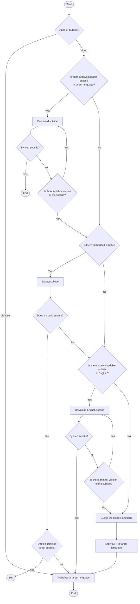

```mermaid
flowchart TD
    start([Start]) --> videoOrSub{Video or Subtitle?}
    
    videoOrSub -- Subtitle --> translate[Translate to target language]
    videoOrSub -- Video --> dlTarget{Is there a downloadable subtitle<br>in target language?}
    
    dlTarget -- Yes --> dlSub[Download subtitle]
    dlTarget -- No --> embedded{Is there embedded subtitle?}
    
    dlSub --> synced1{Synced subtitle?}
    synced1 -- Yes --> end1([End])
    synced1 -- No --> another1{Is there another version<br>of the subtitle?}
    another1 -- Yes --> dlSub
    another1 -- No --> embedded
    
    embedded -- Yes --> extract[Extract subtitle]
    embedded -- No --> dlEnglish{Is there a downloadable subtitle<br>in English?}
    
    extract --> valid{Does it a valid subtitle?}
    valid -- Yes --> sameTarget{Does it same as<br>target subtitle?}
    valid -- No --> dlEnglish
    
    sameTarget -- Yes --> end2([End])
    sameTarget -- No --> translate
    
    dlEnglish -- Yes --> dlEngSub[Download English subtitle]
    dlEnglish -- No --> guess[Guess the source language]
    
    dlEngSub --> synced2{Synced subtitle?}
    synced2 -- Yes --> translate
    synced2 -- No --> another2{Is there another version<br>of the subtitle?}
    another2 -- Yes --> dlEngSub
    another2 -- No --> guess
    
    guess --> stt[Apply STT to target language]
    stt --> translate
    
    translate --> end3([End])
```